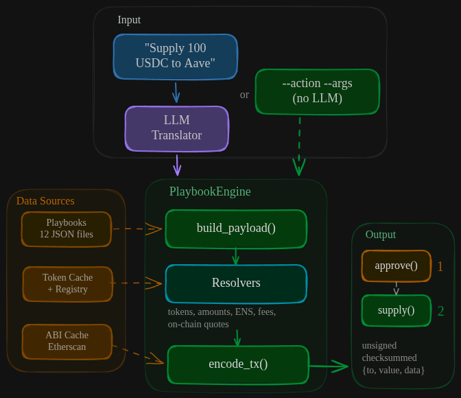

# defi-skills

> **Beta**: This project is under active development.

Translate natural language into unsigned DeFi transaction payloads. A data-driven playbook engine resolves human-readable parameters (token symbols, ENS names, decimal amounts) into ABI-encoded calldata, with zero protocol-specific code in the engine.

**13 protocols. 53 actions. All driven by JSON playbooks.**


https://github.com/user-attachments/assets/cdc2fd63-b007-40a4-900e-a6f775b6e9fa


## Quick Start

### Install via pip (recommended)

```bash
pip install defi-skills --extra-index-url https://nethermind.jfrog.io/artifactory/api/pypi/kyoto-pypi-local-prod/simple
```

### Or clone the repo

```bash
git clone https://github.com/NethermindEth/defi-skills
cd defi-skills
python3 -m venv .venv && source .venv/bin/activate
pip install -e .
```

### Get started

```bash
defi-skills config setup     # interactive wizard
defi-skills actions           # list all supported actions
```

### Deterministic mode (no LLM)

These examples work with no API keys at all (tokens resolved from local cache):

```bash
defi-skills build --action aave_supply --args '{"asset":"USDC","amount":"500"}'
defi-skills build --action lido_stake --args '{"amount":"5"}' --json
defi-skills build --action weth_wrap --args '{"amount":"2"}' --json
```

Actions that need on-chain data (swaps, "max" amounts, ENS names) require `ALCHEMY_API_KEY`:

```bash
defi-skills build --action uniswap_swap --args '{"asset_in":"WETH","asset_out":"USDC","amount":"0.5"}' --json
```

### Interactive chat mode (LLM-powered agent)

```bash
defi-skills chat
defi-skills chat --model gpt-5.1
defi-skills chat --stream          # raw text streaming instead of formatted output
```

An interactive agent that understands natural language, plans multi-step operations, and calls the deterministic engine via tool use. It discovers actions, checks parameters, and builds transactions. Type `/help` inside the chat for commands.

By default, responses are rendered with formatted Markdown after the LLM finishes. Use `--stream` for raw real-time text output, or persist the preference with `defi-skills config set stream_responses true`.

### Simulation (WIP)

Transaction simulation (fork mainnet via Anvil, execute, report gas/transfers/balance changes) is implemented and available for manual testing via `defi-skills simulate`, but is not yet exposed to the chat agent or skill files. This is actively being worked on.

## Agent Integration

This tool is built to be used by AI agents. It ships as a **skill** that any agent with shell access can pick up and use to build DeFi transactions deterministically, with no LLM running inside the CLI.

### How it works for agents

1. The user tells the agent something like "Supply 100 USDC to Aave"
2. The **agent** (Claude Code, OpenClaw, or any LLM with shell access) classifies the intent and picks the right action + arguments
3. The agent calls the CLI with `--action` and `--args` (deterministic, no API key needed)
4. The CLI returns unsigned transactions as JSON
5. The agent presents the result to the user for review and signing

The agent is the LLM. The CLI is the execution engine. No LLM runs inside the CLI in this flow.

### Skill files

Ready-made skill files are included for both Claude Code and OpenClaw:

| Agent | Skill location |
|-------|---------------|
| Claude Code | `.claude/skills/intent-to-transaction/SKILL.md` |
| OpenClaw / generic agents | `openClaw-Skill/SKILL.md` |

Both contain the same instructions. Copy the appropriate file into your project and ensure `defi-skills` is installed with `WALLET_ADDRESS` set. The agent can then invoke it naturally:

> "Supply 100 USDC to Aave"
> "Swap 0.5 ETH for USDC on Uniswap"
> "Buy PT for wstETH on Pendle"

The agent workflow is always: discover actions (`defi-skills actions --json`), check parameters (`defi-skills actions <name> --json`), build transaction (`defi-skills build --action <name> --args '{...}' --json`).

### Claude Code Plugin

If you use Claude Code, you can install the skill directly as a plugin:

```
/plugin marketplace add NethermindEth/defi-skills
/plugin install defi-skills@nethermind-defi-skills
```

After installing, invoke it with:

```
/intent-to-transaction
```

### Why deterministic mode for agents?

Agents already have an LLM (themselves). Running a second LLM inside the CLI would be redundant, slower, and more expensive. The `--action` + `--args` path uses zero LLM tokens and gives agents full control over intent classification while the engine handles the hard parts: token resolution, decimal conversion, ABI encoding, and approval handling.

## How It Works

The CLI has two modes. The `build` command is purely deterministic (no LLM). The `chat` command adds an interactive LLM agent on top.



> For the full component breakdown with resolver details, data layer, and external services, see [**docs/architecture.md**](docs/architecture.md).

**`build` command (deterministic)** -- Takes `--action` + `--args`, resolves parameters, and ABI-encodes the transaction. No LLM involved. This is what agents and scripts call.

**`chat` command (interactive agent)** -- An LLM agent with tool-calling that discovers actions (`action_info`), builds transactions (`build_transaction`), and manages config (`get_config`, `set_config`). The agent calls the same deterministic engine internally.

**PlaybookEngine** -- The core. Deterministic code driven by JSON playbook files. It resolves token symbols to addresses, converts human amounts to Wei, resolves ENS names, determines approval requirements, and ABI-encodes the final calldata. The engine never guesses. It fails with a clear error if data is missing.

### Playbook Architecture

All protocol knowledge lives in JSON files under `src/defi_skills/data/playbooks/`. The engine reads these and executes two phases:

**`build_payload`** - Resolves human-readable arguments into on-chain values:
```json
{
  "payload_args": {
    "asset": { "source": "resolve_token_address", "llm_field": "asset" },
    "amount": { "source": "resolve_amount", "llm_field": "amount", "decimals_from": "$asset" },
    "onBehalfOf": { "source": "resolve_ens_or_hex", "context_field": "from_address" }
  }
}
```

Each `source` maps to a resolver function. Resolvers are composable: `decimals_from: "$asset"` means "look up decimals from the token address resolved by the `asset` field."

**`encode_tx`** - Maps resolved values to ABI parameters and encodes:
```json
{
  "param_mapping": [
    { "source": "arg", "arg_key": "asset", "coerce": "address" },
    { "source": "arg", "arg_key": "amount", "coerce": "uint256" },
    { "source": "context", "context_key": "from_address", "coerce": "address" },
    { "source": "constant", "value": 0, "coerce": "uint256" }
  ]
}
```

ABI entries come from Etherscan-verified contract ABIs cached locally. Function selectors in playbooks disambiguate overloaded functions.

### Resolver System

Resolvers are pure functions registered in `engine/resolvers/__init__.py`. Each takes a raw value + context and returns a resolved on-chain value:

| Resolver | What it does |
|----------|-------------|
| `resolve_token_address` | Symbol ("USDC") to checksummed address, via local cache + 1inch/Alchemy fallback |
| `resolve_amount` | Human amount ("500") to Wei string, using token decimals |
| `resolve_amount_or_max` | Same, but "max" becomes `UINT256_MAX` (for Aave/Compound withdraw/repay) |
| `resolve_amount_or_balance` | Same, but "max" queries actual `balanceOf` on-chain |
| `resolve_ens_or_hex` | ENS name ("vitalik.eth") or hex address to checksummed address |
| `resolve_fee_tier` | Auto-detect Uniswap fee tier from token pair heuristics |
| `resolve_deadline` | Current timestamp + buffer (default 1200s) |
| `resolve_uniswap_quote` | On-chain QuoterV2 call for minimum output with slippage |
| `resolve_balancer_pool_id` | The Graph query for Balancer pool lookup |
| `resolve_interest_rate_mode` | "variable" (2) or reject deprecated "stable" (1) |
| `resolve_pendle_market` | Pendle API lookup: token name ("wstETH") to active market address |
| `resolve_pendle_min_out` | Pendle API quote (spot rates for swaps, convert API for mint/LP) with slippage |
| `resolve_pendle_yt` | YT address from market context, auto-resolved from market lookup |

Protocol-specific resolvers (EigenLayer strategies, Lido withdrawal requests, Curve pool math, Pendle market/quote) live in their own files under `engine/resolvers/`.

### Approval Handling

Playbooks declare approval requirements:
```json
{ "approvals": [{ "token": "$asset", "spender": "target_contract" }] }
```

The CLI builds full `approve()` calldata transactions and returns them in the `transactions` array before the main action. USDT's non-standard approval (requires `approve(0)` before setting a new allowance) is handled automatically.

### Three-Tier Caching

| Cache | Location | Update Strategy |
|-------|----------|----------------|
| Token cache | `data/cache/token_cache.json` | Auto-updates on new token discovery via 1inch/Alchemy |
| ABI cache | `data/abi_cache/*.json` | Static, fetched once via `python -m defi_skills.data.fetch_abis` |
| Registry | `data/registry/*.json` | Manual refresh via `scripts/refresh_registry.py` for governance-mutable state |

## Output Format

With `--json`, the output is an ordered `transactions` array. Execute them in sequence, approvals first, then the main action:

```json
{
  "success": true,
  "transactions": [
    {
      "type": "approval",
      "token": "0xA0b86991c6218b36c1d19D4a2e9Eb0cE3606eB48",
      "spender": "0x87870Bca3F3fD6335C3F4ce8392D69350B4fA4E2",
      "raw_tx": { "chain_id": 1, "to": "0xA0b8...", "value": "0", "data": "0x095ea7b3..." }
    },
    {
      "type": "action",
      "action": "aave_supply",
      "target_contract": "0x87870Bca3F3fD6335C3F4ce8392D69350B4fA4E2",
      "function_name": "supply",
      "arguments": { "asset": "0xA0b8...", "amount": "500000000" },
      "raw_tx": { "chain_id": 1, "to": "0x8787...", "value": "0", "data": "0x617ba037..." }
    }
  ]
}
```

The `raw_tx` contains `{chain_id, to, value, data}`, everything needed to sign and broadcast. Gas estimation and nonce management are left to the signing wallet.

On failure: `{"success": false, "error": "description"}`.

## Supported Protocols

| Protocol | Actions |
|----------|---------|
| Native ETH | `transfer_native` |
| ERC-20 | `transfer_erc20` |
| ERC-721 | `transfer_erc721` (CryptoPunks `transferPunk` override) |
| Aave V3 | `aave_supply`, `aave_withdraw`, `aave_borrow`, `aave_repay`, `aave_set_collateral`, `aave_repay_with_atokens`, `aave_claim_rewards` |
| Lido | `lido_stake`, `lido_wrap_steth`, `lido_unwrap_wsteth`, `lido_unstake`, `lido_claim_withdrawals` |
| Uniswap V3 | `uniswap_swap`, `uniswap_lp_mint`, `uniswap_lp_collect`, `uniswap_lp_decrease`, `uniswap_lp_increase` |
| Curve | `curve_add_liquidity`, `curve_remove_liquidity`, `curve_gauge_deposit`, `curve_gauge_withdraw`, `curve_mint_crv` |
| WETH | `weth_wrap`, `weth_unwrap` |
| Compound V3 | `compound_supply`, `compound_withdraw`, `compound_borrow`, `compound_repay`, `compound_claim_rewards` |
| MakerDAO DSR | `maker_deposit`, `maker_redeem` |
| Rocket Pool | `rocketpool_stake`, `rocketpool_unstake` |
| EigenLayer | `eigenlayer_deposit`, `eigenlayer_delegate`, `eigenlayer_undelegate`, `eigenlayer_queue_withdrawals`, `eigenlayer_complete_withdrawal` |
| Balancer V2 | `balancer_swap`, `balancer_join_pool`, `balancer_exit_pool` |
| Pendle V2 | `pendle_swap_token_for_pt`, `pendle_swap_pt_for_token`, `pendle_swap_token_for_yt`, `pendle_swap_yt_for_token`, `pendle_add_liquidity`, `pendle_remove_liquidity`, `pendle_mint_py`, `pendle_redeem_py`, `pendle_claim_rewards` |

Run `defi-skills actions <name>` to see required/optional parameters for any action.

## Project Structure

```
src/defi_skills/
  cli/
    main.py              # Click CLI: build, simulate, actions, config commands
    chat.py              # Interactive LLM agent (defi-skills chat)
    simulate.py          # Anvil fork management and transaction simulation
    config.py            # ~/.defi-skills/config.json management
  engine/
    playbook_engine.py   # Core two-stage pipeline (build_payload + encode_tx)
    token_resolver.py    # Token symbol/address resolution with caching
    ens_resolver.py      # ENS name resolution (live-only, no cache)
    tx_encoder.py        # ABI loading + eth_abi encoding
    resolvers/           # Resolver functions (core + protocol-specific)
      __init__.py        # RESOLVER_REGISTRY: maps source names to functions
      common.py          # Shared utilities (raw_eth_call, address validation)
      core.py            # Token, amount, address, fee, deadline resolvers
      uniswap.py         # Quoting, LP position, tick range resolvers
      balancer.py        # Pool ID, limit, token ordering resolvers
      curve.py           # Min mint/amounts, pool math resolvers
      eigenlayer.py      # Strategy, deposit, withdrawal resolvers
      lido.py            # Withdrawal request, checkpoint resolvers
      aave.py            # Reward asset resolvers
      pendle.py          # Market lookup, swap quote, YT address resolvers
  data/
    playbooks/*.json     # Protocol definitions (13 files)
    abi_cache/*.json     # Etherscan-verified ABIs
    cache/               # Token resolution cache (ENS is live-only)
    registry/            # Governance-mutable state (EigenLayer strategies, Compound tokens)
    fetch_abis.py        # ABI fetching utility (run: python -m defi_skills.data.fetch_abis)

skills/
  intent-to-transaction/ # OpenClaw-compatible skill manifest
.claude/
  skills/
    intent-to-transaction/ # Claude Code skill (same content)

examples/
  defi-agent/            # Full-stack DeFi agent demo (FastAPI + LLM + MetaMask signing)

scripts/                 # Dev-time tooling (not packaged)
  generate_playbook.py   # LLM-assisted playbook generation from contract ABI
  populate_cache.py      # Pre-populate token cache with common symbols
  refresh_registry.py    # Query on-chain governance state into registry/

tests/
  test_playbook_parity.py  # 55 parametrized tests covering all actions
```

## Configuration

### Interactive setup (recommended)

```bash
defi-skills config setup
```

Walks you through wallet address, LLM API key, and optional provider keys. Settings are stored at `~/.defi-skills/config.json` (file permissions: owner-only read/write).

### API keys

Environment variables are the recommended way to set API keys. They are ephemeral (gone when your shell closes), never touch disk, and take precedence over the config file.

```bash
export ALCHEMY_API_KEY="your-key"
export ANTHROPIC_API_KEY="your-key"
```

For convenience, you can also persist keys via the CLI. These are stored in `~/.defi-skills/config.json` with restricted file permissions (`0600`), and are used as fallbacks when the corresponding environment variable is not set.

```bash
defi-skills config set alchemy_api_key "your-key"
```

**Always required:**

| Variable | Purpose |
|----------|---------|
| `WALLET_ADDRESS` | Your wallet address (used as `from_address` in transactions) |

**Required for most actions:**

| Variable | Purpose | When you need it |
|----------|---------|------------------|
| `ALCHEMY_API_KEY` | RPC via Alchemy | ENS resolution, on-chain quotes (Uniswap/Balancer/Curve), balance queries ("max" amounts), EigenLayer strategy verification, Lido/Aave reward discovery. Without it, only basic actions with known tokens and specific amounts work (e.g. `aave_supply` with USDC and a fixed amount). |

**Required for specific features:**

| Variable | Purpose | When you need it |
|----------|---------|------------------|
| `ANTHROPIC_API_KEY` or `OPENAI_API_KEY` | LLM provider | Only for `defi-skills chat` (interactive agent mode). Not needed for `build`, `simulate`, or `actions`. |
| `THEGRAPH_API_KEY` | The Graph subgraph queries | Only for Balancer V2 actions (`balancer_swap`, `balancer_join_pool`, `balancer_exit_pool`). |

**Optional:**

| Variable | Purpose | When you need it |
|----------|---------|------------------|
| `ETHERSCAN_API_KEY` | Fetch verified contract ABIs | Only when adding a new protocol. Run `python -m defi_skills.data.fetch_abis` once, then the ABIs are cached locally. |
| `ONEINCH_API_KEY` | Token symbol discovery | Only when resolving a token not in the local cache (~100 common tokens are pre-cached). Falls back to on-chain query via Alchemy if not set. |

## Adding a New Protocol

### Option 1: Claude Code agent (recommended)

A custom Claude Code agent handles the full workflow — research, ABI fetching, proxy detection, playbook generation, and validation:

```
@playbook-generator Add Morpho protocol
```

The agent at `.claude/agents/playbook-generator.md` will:
1. Search the web for contract addresses and documentation
2. Detect proxy patterns (Diamond/multi-facet) and fetch all facet ABIs
3. Run `generate_playbook.py` with the right arguments
4. Review the output and fix passthrough params, approvals, and struct defaults
5. Validate against cached ABIs and run the test suite

### Option 2: CLI script

Run the playbook generator directly:

```bash
python scripts/generate_playbook.py \
  --protocol morpho_blue \
  --contracts "pool=0xBBBBBbbBBb9cC5e90e3b3Af64bdAF62C37EEFFCb" \
  --functions supply,withdraw,borrow,repay \
  --model claude-sonnet-4-6
```

For Diamond/multi-facet proxies, use `--facets` to provide additional facet addresses:

```bash
python scripts/generate_playbook.py \
  --protocol pendle \
  --contracts router=0x888888888889758F76e7103c6CbF23ABbF58F946 \
  --facets 0xd8D200d9... 0x4a03Ce0a... 0x373Dba20... \
  --functions swapExactTokenForPt,addLiquiditySingleToken
```

The script will:
1. Fetch the verified ABI from Etherscan (auto-detects standard EIP-2535 Diamond proxies)
2. Filter user-facing write functions (skips admin/view/pure)
3. Classify each parameter's semantic role via LLM (token address, amount, sender, constant, etc.)
4. Assemble a complete playbook JSON with `payload_args` + `param_mapping`
5. Validate selectors against the cached ABI
6. Flag anything the LLM couldn't classify for human review

Review the generated JSON, fix any flagged items, and drop it into `src/defi_skills/data/playbooks/`. The engine picks it up automatically, no code changes needed.

For protocols that need custom on-chain resolution (e.g., pool discovery, strategy lookups, slippage quotes), add a resolver in `engine/resolvers/` and register it in `__init__.py`.

See [CONTRIBUTING.md](CONTRIBUTING.md) for the full walkthrough.

## Known Limitations

- **Mainnet only (for now).** All contract addresses in playbooks are for chain ID 1. Multi-chain support is on the roadmap.
- **No gas estimation.** Output is `{chain_id, to, value, data}`. The signing wallet must estimate gas and set nonce.
- **Simulation is WIP.** The `simulate` command forks mainnet and executes transactions, but is not yet integrated into the chat agent or skill files. It can be used manually via the CLI. It funds the wallet with ETH only, so actions that spend ERC-20 tokens may revert if the wallet doesn't hold them on mainnet.
- **No signing or broadcasting.** Output is always unsigned. This is intentional: the tool is a transaction builder, not a wallet.
- **Static contract addresses.** Playbooks hardcode contract addresses. If a protocol upgrades its contracts, playbooks need manual updates.
- **Token cache writes to package directory.** When a new token is discovered, it's persisted to `data/cache/token_cache.json` inside the installed package. This can fail with permission errors in system-wide installs.
- **`time.time()` for deadlines.** Deadline calculation uses system clock. Incorrect system time can produce expired deadlines.
- **Single-hop swaps only.** Uniswap and Balancer swaps use single-hop routing. Multi-hop paths are not supported.

## Safety

- Output is always an **unsigned transaction**. The tool never signs or broadcasts.
- No private keys are involved at any stage.
- The deterministic path (`--action` + `--args`) uses zero LLM tokens.
- All addresses in output are EIP-55 checksummed.
- USDT's non-standard approval is handled automatically (reset to zero first).
- DEX operations include on-chain quoting with configurable slippage protection.
- Resolvers raise errors on failure instead of returning defaults. Broken transactions are never silently produced.
- Always review `to`, `value`, and `data` before signing.

## Running Tests

```bash
pip install -e ".[dev]"
pytest tests/ -v
```

All 55 tests run offline with mocked on-chain calls. No API keys or RPC connection needed.

## License

[MIT](LICENSE)
