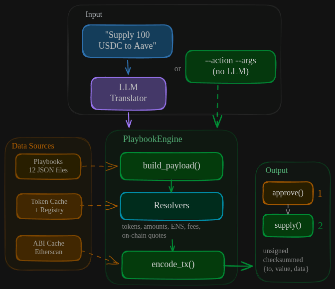

# defi-skills

[](LICENSE) [](https://www.python.org)   

Translate natural language into unsigned DeFi transaction payloads. A data-driven playbook engine resolves human-readable parameters (token symbols, ENS names, decimal amounts) into ABI-encoded calldata, with zero protocol-specific code in the engine.

### Give your agent DeFi superpowers

**Claude Code:**
```
/plugin marketplace add NethermindEth/defi-skills
/plugin install defi-skills@nethermind-defi-skills
```

**OpenClaw:**
```
npx clawhub install defi-skills
```

That's it. Your agent can now build DeFi transactions:

> *"Supply 100 USDC to Aave"* · *"Swap 0.5 ETH for USDC on Uniswap"* · *"Stake 5 ETH on Lido"*


https://github.com/user-attachments/assets/cdc2fd63-b007-40a4-900e-a6f775b6e9fa


## Install

```bash
pip install defi-skills --extra-index-url https://nethermind.jfrog.io/artifactory/api/pypi/kyoto-pypi-local-prod/simple
```

Or from source:

```bash
git clone https://github.com/NethermindEth/defi-skills
cd defi-skills
python3 -m venv .venv && source .venv/bin/activate
pip install -e .
```

## Quick Start

```bash
defi-skills config setup                  # interactive wizard
defi-skills actions                       # list all actions
defi-skills actions --chain-id 11155111   # list Sepolia actions
```

Build unsigned transactions (fully deterministic, no LLM requierd):

```bash
# Mainnet
defi-skills build --action aave_supply --args '{"asset":"USDC","amount":"500"}' --json

# Sepolia
defi-skills build --action aave_supply --args '{"asset":"WETH","amount":"1"}' --chain-id 11155111 --json

# More examples
defi-skills build --action uniswap_swap --args '{"asset_in":"WETH","asset_out":"USDC","amount":"0.5"}' --json
defi-skills build --action lido_stake --args '{"amount":"5"}' --json
defi-skills build --action weth_wrap --args '{"amount":"2"}' --json
```

Interactive chat mode (requires LLM API key):

```bash
defi-skills chat
```

## Output

```json
{
  "success": true,
  "transactions": [
    {
      "type": "approval",
      "raw_tx": { "chain_id": 1, "to": "0xA0b8...", "value": "0", "data": "0x095ea7b3..." }
    },
    {
      "type": "action",
      "action": "aave_supply",
      "function_name": "supply",
      "raw_tx": { "chain_id": 1, "to": "0x8787...", "value": "0", "data": "0x617ba037..." }
    }
  ]
}
```

Each `raw_tx` contains `{chain_id, to, value, data}` -- everything needed to sign and broadcast. The tool never signs or broadcasts. Gas estimation and nonce management are left to the signing wallet.

## Supported Protocols

| Protocol | Chains | Actions |
|----------|--------|---------|
| Native ETH | All | `transfer_native` |
| ERC-20 | All | `transfer_erc20` |
| ERC-721 | All | `transfer_erc721` |
| WETH | Mainnet, Arbitrum, Base, Optimism, Sepolia | `weth_wrap`, `weth_unwrap` |
| Aave V3 | Mainnet, Arbitrum, Base, Optimism, Polygon, Sepolia | `aave_supply`, `aave_withdraw`, `aave_borrow`, `aave_repay`, `aave_set_collateral`, `aave_repay_with_atokens`, `aave_claim_rewards` |
| Uniswap V3 | Mainnet, Arbitrum, Base, Optimism, Polygon, Sepolia | `uniswap_swap`, `uniswap_lp_mint`, `uniswap_lp_collect`, `uniswap_lp_decrease`, `uniswap_lp_increase` |
| Compound V3 | Mainnet, Arbitrum, Base, Optimism, Polygon | `compound_supply`, `compound_withdraw`, `compound_borrow`, `compound_repay`, `compound_claim_rewards` |
| Balancer V2 | Mainnet, Arbitrum, Base, Optimism, Polygon | `balancer_swap`, `balancer_join_pool`, `balancer_exit_pool` |
| Lido | Mainnet | `lido_stake`, `lido_wrap_steth`, `lido_unwrap_wsteth`, `lido_unstake`, `lido_claim_withdrawals` |
| Curve | Mainnet | `curve_add_liquidity`, `curve_remove_liquidity`, `curve_gauge_deposit`, `curve_gauge_withdraw`, `curve_mint_crv` |
| MakerDAO DSR | Mainnet | `maker_deposit`, `maker_redeem` |
| Rocket Pool | Mainnet | `rocketpool_stake`, `rocketpool_unstake` |
| EigenLayer | Mainnet | `eigenlayer_deposit`, `eigenlayer_delegate`, `eigenlayer_undelegate`, `eigenlayer_queue_withdrawals`, `eigenlayer_complete_withdrawal` |
| Pendle V2 | Mainnet | `pendle_swap_token_for_pt`, `pendle_swap_pt_for_token`, `pendle_swap_token_for_yt`, `pendle_swap_yt_for_token`, `pendle_add_liquidity`, `pendle_remove_liquidity`, `pendle_mint_py`, `pendle_redeem_py`, `pendle_claim_rewards` |

## How It Works



The engine has two modes: `build` (deterministic, no LLM) and `chat` (interactive LLM agent on top). Both use the same pipeline:

1. **Playbooks** -- JSON files define each protocol's actions, parameters, and ABI mappings. Chain-agnostic: no hardcoded addresses.
2. **ChainResources** -- Per-chain contract addresses in `data/chains/{chain_id}/{protocol}.json`. Supports action overrides (different ABIs) and token overrides (different addresses) per chain.
3. **Resolvers** -- Pure functions that transform human inputs (token symbols, ENS names, amounts) into on-chain values (addresses, wei, calldata).
4. **Encoder** -- Maps resolved values to ABI parameters and produces the final `{to, value, data}`.

> For the full component breakdown, see [docs/architecture.md](docs/architecture.md).

## Adding a New Protocol

Use the Claude Code agent for the fastest path:

```
@playbook-generator Add Morpho protocol
```

Or generate manually:

```bash
python scripts/generate_playbook.py \
  --protocol morpho_blue \
  --contracts "pool=0xBBBB..." \
  --functions supply,withdraw,borrow,repay
```

> See [CONTRIBUTING.md](CONTRIBUTING.md) for the full walkthrough, including multi-chain support and fork validation.

## Configuration

```bash
defi-skills config setup   # interactive wizard
```

Key environment variables:

| Variable | Required for |
|----------|-------------|
| `WALLET_ADDRESS` | All commands |
| `ALCHEMY_API_KEY` | On-chain quotes, ENS, balance queries (enable all chains in your Alchemy dashboard) |
| `ONEINCH_API_KEY` | Token discovery on L2s (Arbitrum, Base, Optimism, Polygon) |
| `ANTHROPIC_API_KEY` | Chat mode only |

> See [docs/configuration.md](docs/configuration.md) for the full list.

## Safety

- Output is always **unsigned**. The tool never signs or broadcasts.
- No private keys involved at any stage.
- All addresses EIP-55 checksummed.
- DEX operations include on-chain quoting with configurable slippage protection.
- Resolvers raise errors on failure. Broken transactions are never silently produced.

## Known Limitations

- **6 chains**: Mainnet, Arbitrum, Base, Optimism, Polygon, and Sepolia. Adding a protocol to an existing chain requires only data files. Adding a new chain also requires registering it in `chains.py`.
- **No gas estimation** -- the signing wallet handles gas and nonce.
- **Single-hop swaps only** on Uniswap and Balancer.
- **Static contract addresses** -- protocol upgrades require manual updates to chain resource files.

## Tests

```bash
pip install -e ".[dev]"
pytest tests/ -v   # fully offline, no API keys needed
```

## License

[MIT](LICENSE)
