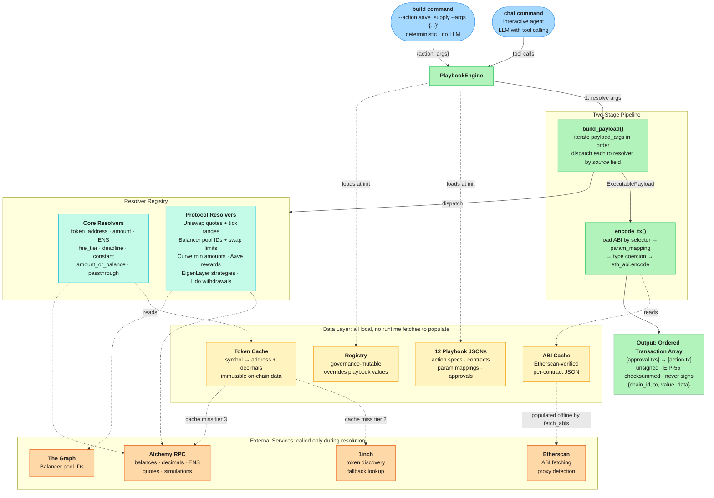

```mermaid
flowchart TB
    BUILD_CMD(["<b>build command</b><br/>--action aave_supply --args '{...}'<br/>deterministic · no LLM"])
    CHAT_CMD(["<b>chat command</b><br/>interactive agent<br/>LLM with tool calling"])

    CHAT_CMD -->|"tool calls"| PBE
    BUILD_CMD -->|"{action, args}"| PBE

    PBE["<b>PlaybookEngine</b>"]

    PBE -->|"1. resolve args"| BUILD
    BUILD -->|"ExecutablePayload"| ENCODE
    PBE -.->|"loads at init"| PB & REG

    subgraph STAGE ["Two-Stage Pipeline"]
        BUILD["<b>build_payload()</b><br/>iterate payload_args in order<br/>dispatch each to resolver by <i>source</i> field"]
        ENCODE["<b>encode_tx()</b><br/>load ABI by selector → param_mapping<br/>→ type coercion → eth_abi.encode"]
    end

    BUILD -->|"dispatch"| RESOLVERS

    subgraph RESOLVERS ["Resolver Registry"]
        direction TB
        CORE["<b>Core Resolvers</b><br/>token_address · amount · ENS<br/>fee_tier · deadline · constant<br/>amount_or_balance · passthrough"]
        PROTO["<b>Protocol Resolvers</b><br/>Uniswap quotes + tick ranges<br/>Balancer pool IDs + swap limits<br/>Curve min amounts · Aave rewards<br/>EigenLayer strategies · Lido withdrawals"]
    end

    ENCODE -.->|"reads"| ABI

    subgraph DATA ["Data Layer: all local, no runtime fetches to populate"]
        direction LR
        PB["<b>12 Playbook JSONs</b><br/>action specs · contracts<br/>param mappings · approvals"]
        ABI["<b>ABI Cache</b><br/>Etherscan-verified<br/>per-contract JSON"]
        CACHE["<b>Token Cache</b><br/>symbol → address + decimals<br/>immutable on-chain data"]
        REG["<b>Registry</b><br/>governance-mutable<br/>overrides playbook values"]
    end

    CORE -.->|"reads"| CACHE
    CORE & PROTO -.-> RPC
    PROTO -.-> GRAPH

    subgraph EXT ["External Services: called only during resolution"]
        direction LR
        RPC["<b>Alchemy RPC</b><br/>balances · decimals · ENS<br/>quotes · simulations"]
        ESCAN["<b>Etherscan</b><br/>ABI fetching<br/>proxy detection"]
        INCH["<b>1inch</b><br/>token discovery<br/>fallback lookup"]
        GRAPH["<b>The Graph</b><br/>Balancer pool IDs"]
    end

    CACHE -.->|"cache miss tier 2"| INCH
    CACHE -.->|"cache miss tier 3"| RPC
    ABI -.->|"populated offline by fetch_abis"| ESCAN

    ENCODE --> OUT

    OUT["<b>Output: Ordered Transaction Array</b><br/>[approval txs] → [action tx]<br/>unsigned · EIP-55 checksummed · never signs<br/>{chain_id, to, value, data}"]

    classDef input fill:#a5d8ff,stroke:#4a9eed,color:#1e1e1e
    classDef llm fill:#d0bfff,stroke:#8b5cf6,color:#1e1e1e
    classDef engine fill:#b2f2bb,stroke:#22c55e,color:#1e1e1e
    classDef resolver fill:#c3fae8,stroke:#06b6d4,color:#1e1e1e
    classDef data fill:#fff3bf,stroke:#f59e0b,color:#1e1e1e
    classDef ext fill:#ffd8a8,stroke:#e8590c,color:#1e1e1e
    classDef output fill:#b2f2bb,stroke:#15803d,color:#1e1e1e
    classDef stage fill:#edf8f0,stroke:#22c55e

    class BUILD_CMD,CHAT_CMD input
    class PBE,BUILD,ENCODE engine
    class CORE,PROTO resolver
    class PB,ABI,CACHE,REG data
    class RPC,ESCAN,INCH,GRAPH ext
    class OUT output
```
